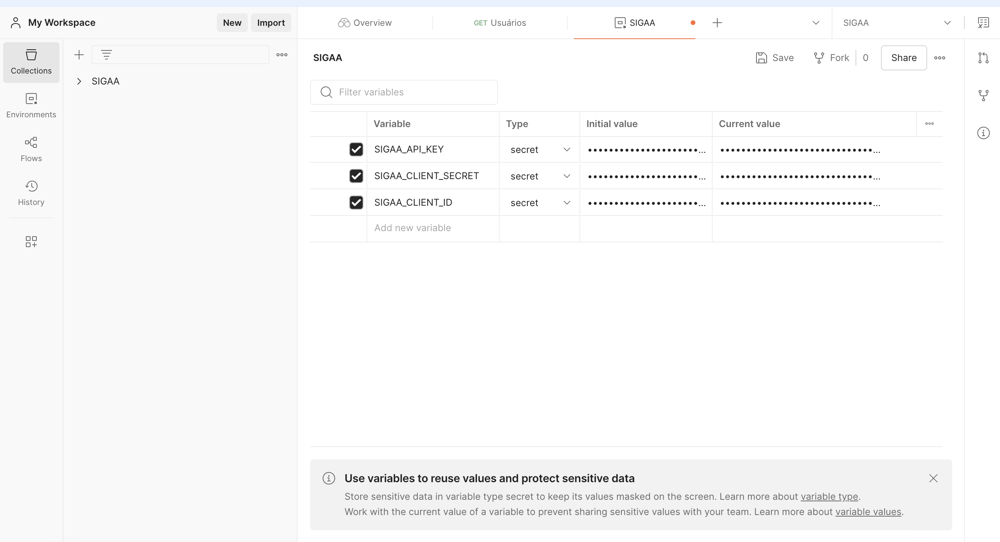
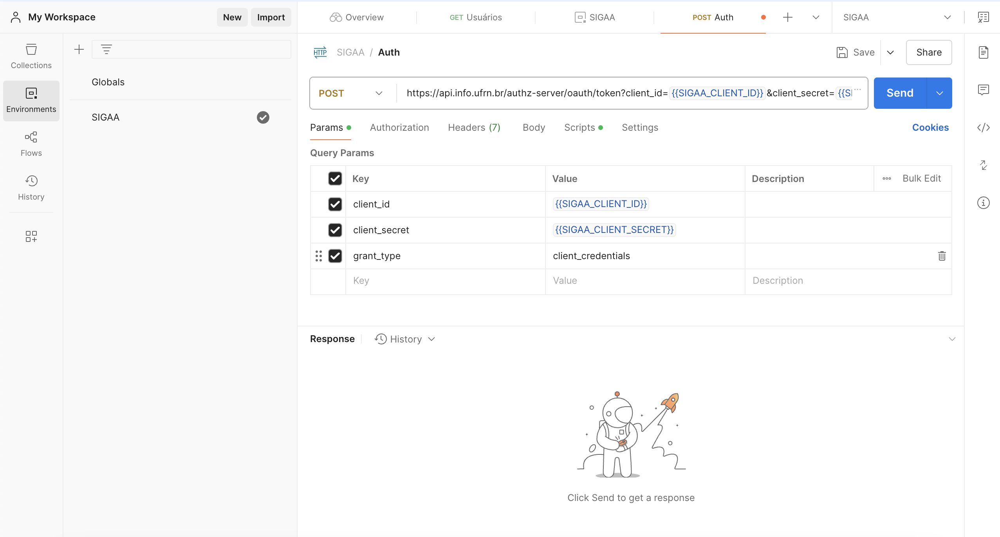
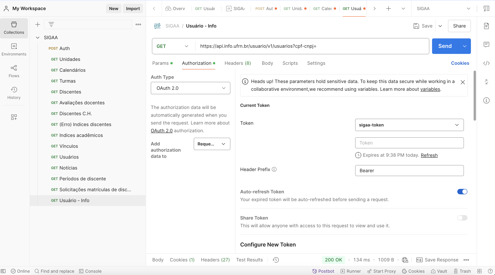
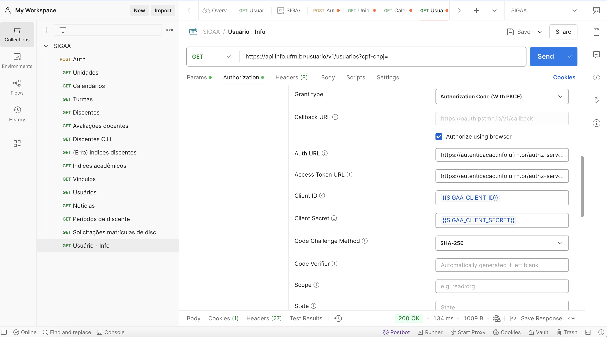
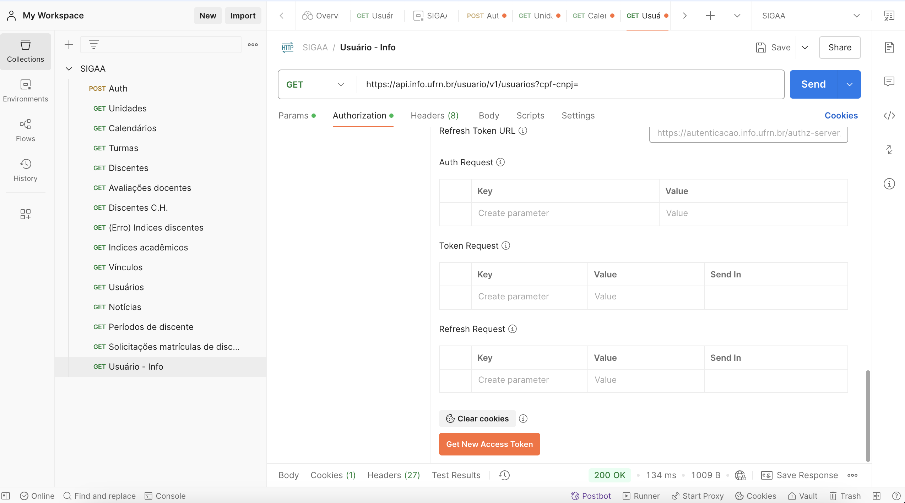

# Configuração OAuth2 do Postman

Neste documento descreveremos como utilizar a SIGAA através do Postman com um token de acesso e com um token de usuário:

## Pré-requesitos

- Postman instalado
- API Key do SIGAA
- Client Id do SIGAA
- Client Secret do SIGAA

## Criando um environment no Postman

Recomenda-se que seja utilizado um environment (ambiente) no postman para guardar variaveis e segredos importantes, evitando
que eles fiquem "hard-coded" e evitando também repetição.

Para criar um environment no Postman, clique no canto superior direito em "No Environment" e depois clique no ícone "+"

## Configurando variaveis de ambiente

Criado o environment, o próximo passo é adicionar nos campos os secrets necessários para o consumo da api:

## Consumindo dados sem estar logado

Para consumir dados sem estar logado, é necessário adquirir um token de acesso. Para isso você deve fazer uma requisição POST para o endpoint `https://api.info.ufrn.br/authz-server/oauth/token?client_id={{SIGAA_CLIENT_ID}}&client_secret={{SIGAA_CLIENT_SECRET}}&grant_type=client_credentials`

Os valores `{{SIGAA_CLIENT_ID}}` e `{{SIGAA_CLIENT_SECRET}}` são herdados diretamente do environment, que deve ser previamente selecionado no canto superior direito.

Com a requisição bem sucedida, o Postman irá automaticamente configurar o token recebido como header para autenticação.

Com isso você está pronto para consumir a API do SIGAA, porém não poderá consumir seus dados pessoais ou dados pessoais de outro usuário

## Consumindo dados com Login

Com o environment já configurado, selecione uma request e então o campo de Authorization. No campo de Authorization Selecione OAuth2.

Com isso, role um pouco para baixo e configure os campos com os seguintes valores:

|               |                                                                |
|---------------|----------------------------------------------------------------|
| auth-url      | https://autenticacao.info.ufrn.br/authz-server/oauth/authorize |
| token-url     | https://autenticacao.info.ufrn.br/authz-server/oauth/token     |
| client-id     | {{SIGAA_CLIENT_ID}} (Herdado do ambiente)                      |
| client-secret | {{SIGAA_CLIENT_SECRET}} (Herdado do ambiente)                  |

E marque o campo "Authorize using Browser" para fazer login no SIGAA pelo navegador.

O resultado final deve ser similar a:

Por fim, role até o final e clique em "Get New Access Token", ao clicar você será redirecionado ao navegador
onde deve fazer login com o SIGAA.

OBS: No ambiente de testes a senha e o login são os mesmos.

Feito isso, o Postman agora terá um token de acesso referente ao seu usuário, permitindo que você consuma seus dados pessoais,para utiliza-ló quando for fazer uma requisição basta ir até a aba de "Authorization" em uma request e selecionar OAuth2.

